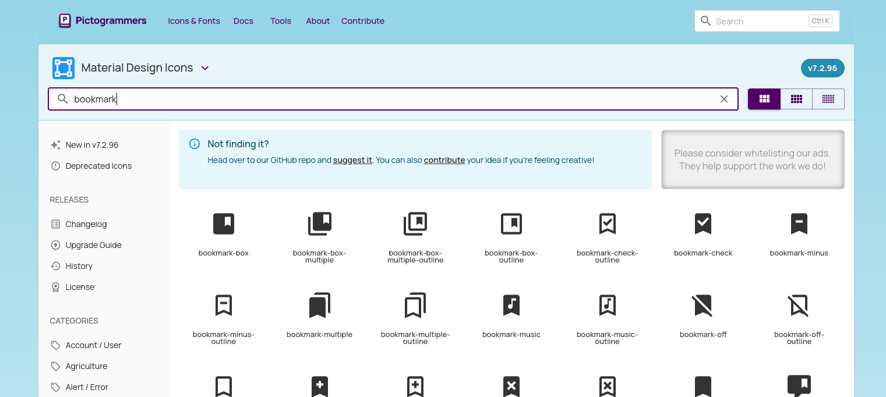
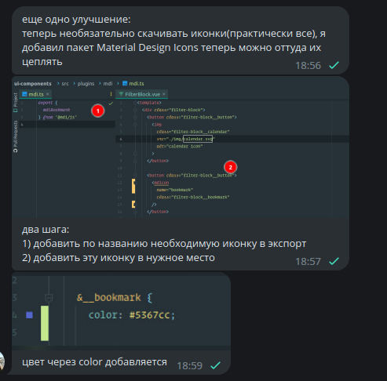

# MDI 

## How to use mdi icons?

1) add icon to mdi export in mdi.ts 
2) insert the icon in needed component
```vue
    <mdicon name="name-icon-without-mdi" class=".some-class" />
```

## How to search icon name from design?
- through autocompletion  
or 
- on this page: https://pictogrammers.com/library/mdi/


## Additional(ru)

